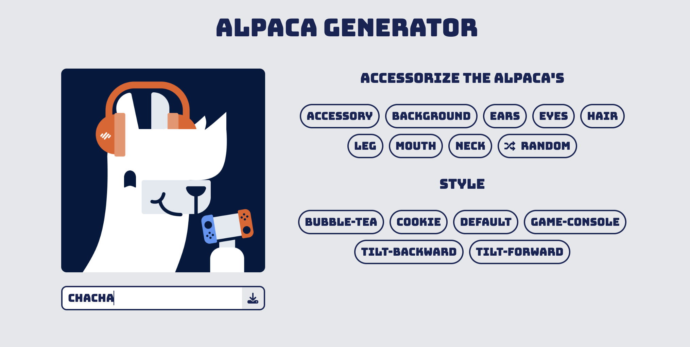

# 🦙 Alpacasso

Customize your very own alpaca avatar with styles, accessories, and flair — then download it with a name of your choice!

## 🚀 Live Demo

Check it out here: [https://alpacasso.vercel.app/](https://alpacasso.vercel.app/)

## 📸 Screenshot



## ✨ Features

- 🎨 Mix and match alpaca styles: hair, eyes, mouth, ears, and more
- 🎲 Randomize button for surprise combinations
- 📝 Name your alpaca
- 📥 Download your creation as a PNG image
- 🌐 Fully responsive and mobile-friendly
- 🎯 Built with **React**, **Vite**, and **Tailwind CSS**

## 🚀 Getting Started

### 1. Clone the repo

```bash
git clone https://github.com/Sereyvidya/Alpacasso
cd Alpacasso
```

### 2. Install dependencies

```bash
npm install
```

### 3. Run the development server

```bash
npm run dev
```

App will be running at: `http://localhost:5173`

## 🛠 Tech Stack

- ⚛️ React
- ⚡ Vite
- 🎨 Tailwind CSS
- 📦 `html2canvas-pro`
- 📦 `react-icons`

## 📁 Folder Structure

```bash
├── public/
│   └── [images for accessories, hair, etc.]
├── src/
│   ├── components/
│   │   ├── AlpacaPreview.jsx
│   │   └── ControlPanel.jsx
│   ├── App.jsx
│   └── index.css
├── index.html
└── package.json
```

## 🙌 Credits

- Inspired by the [Alpaca image generator website](https://www.codementor.io/projects/web/alpaca-image-generator-website-ce2oc0eus8) challenge from DevProjects.

## 🪪 License

MIT — feel free to remix and share!
